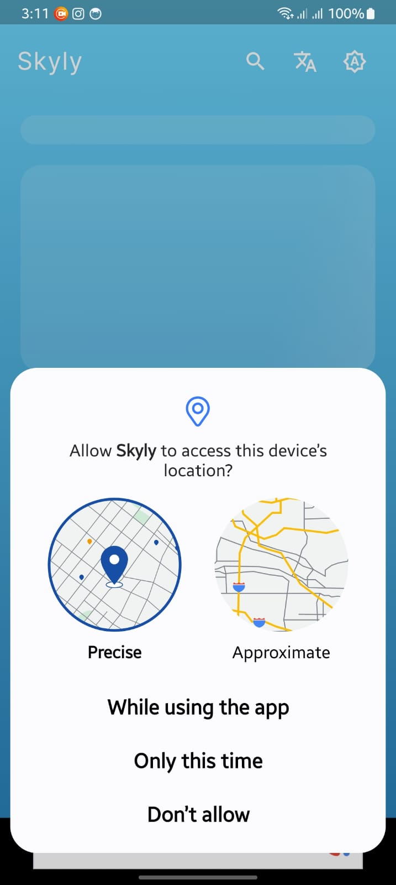
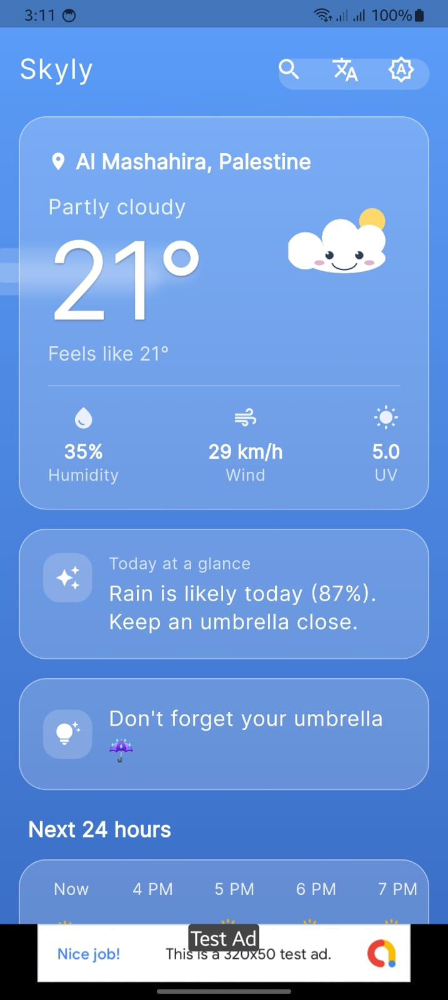
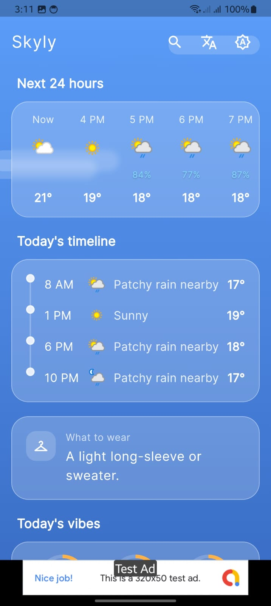
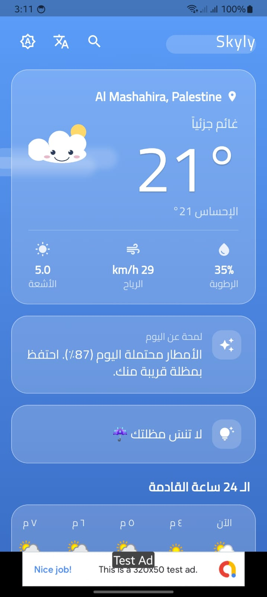
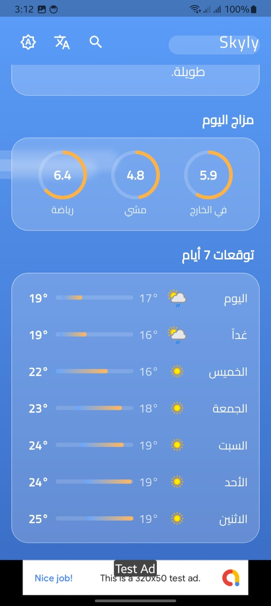
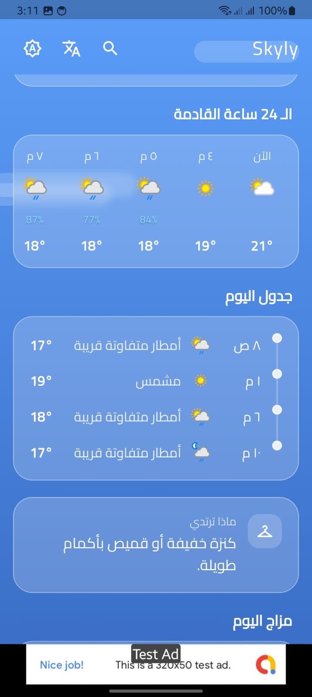
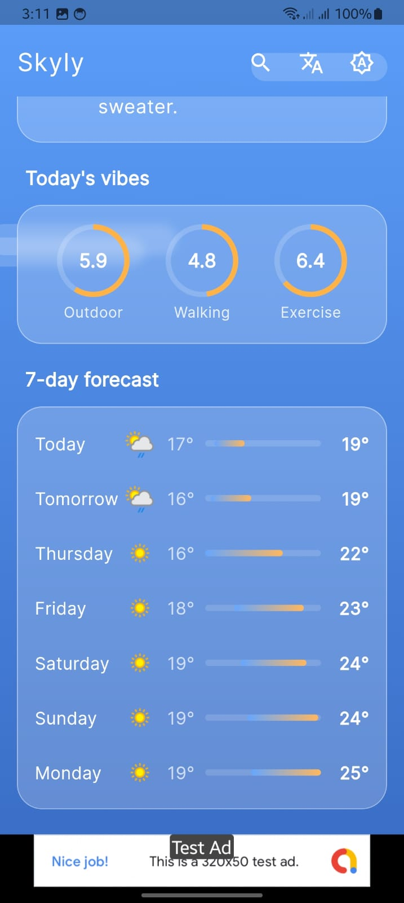
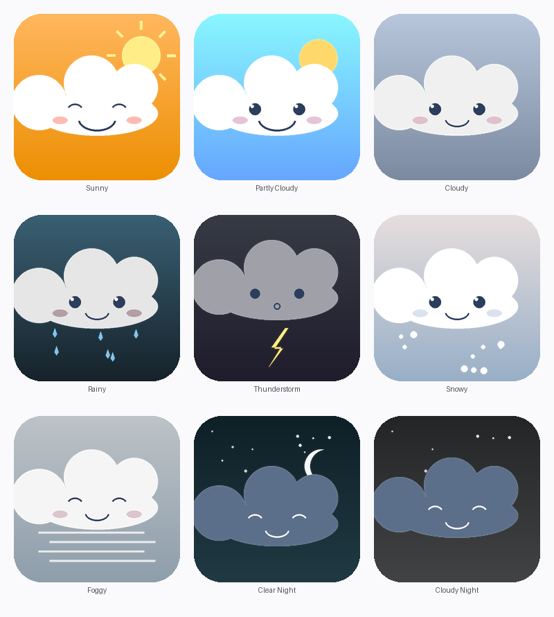

<div align="center">


# Skyly

### Your daily companion, powered by weather

A smart, mood-reactive Flutter weather app that feels like a daily companion — not a data dashboard.

[](https://flutter.dev)
[](https://dart.dev)
[](https://riverpod.dev)
[](#license)
[](#)

</div>

<div align="center">

📖 **[العربية](#-نبذة-عن-التطبيق)** • **[English](#-screenshots)**

</div>

---

## 🌤️ نبذة عن التطبيق

<div dir="rtl">

**Skyly** هو تطبيق طقس ذكي مبني بـ Flutter، صُمّم ليكون **رفيقك اليومي** لا مجرد لوحة بيانات باردة.

### ما الذي يميّزه؟

- 🎭 **شخصية تفاعلية ("Sky")** — سحابة كرتونية لطيفة بتسعة تعابير مختلفة، تتغيّر حسب الطقس الحالي. مشمس → عيون مغمضة سعيدة. ماطر → وقطرات حولها. ثلجي → ندفات. ليل → نائمة مع قمر ونجوم.

- 🌈 **خلفيات ديناميكية** — تسعة تدرّجات لونية تنعكس على مزاج الطقس الحالي.

- 🧠 **ذكاء محلي بدون AI خارجي** — ملخّص يومي ذكي + اقتراحات ملابس + رسائل ودودة + تقييمات اليوم (للنشاط الخارجي والمشي والرياضة)، كلها تشتغل محلياً بدون استدعاء أي API ذكاء اصطناعي.

- 🌍 **دعم كامل للعربية والإنجليزية** مع تبديل RTL/LTR تلقائي وخطوط مناسبة لكل لغة (Inter للإنجليزي، Cairo للعربي).

- 🎨 **مظاهر متعدّدة** — فاتح / داكن / حسب النظام، مع حفظ التفضيل تلقائياً.

- 🏎️ **أداء عالي** — cache ذكي يقلّل من استهلاك الـ API، blur محسّن للـ GPU، animations خفيفة، splash screen مختصر.

- 📍 **GPS + بحث يدوي** — يحدّد موقعك تلقائياً، أو ابحث عن أي مدينة بالعالم.

</div>

---

## 📱 Screenshots

> **Note:** Add the 8 screenshot files (provided separately) to a `screenshots/` folder at the project root before committing.

### Onboarding & Permissions

<div align="center">

</div>

The first run requests location access using the standard Android permission flow. If denied, the app shows a friendly empty state with a CTA to open device settings.

---

### Home Screen — English

<div align="center">

</div>

The hero card shows current temperature, the dynamic Sky mascot reacting to the condition, "feels like" temperature, and three key metrics: humidity, wind, UV index. Below it, a **smart summary** card auto-generates a contextual one-liner ("Rain is likely today (87%). Keep an umbrella close.") and a **friendly tip** card with an emoji-decorated reminder.

---

### Today's Timeline — English

<div align="center">

</div>

A 24-hour horizontal forecast strip showing temperature, condition icon, and rain probability for each upcoming hour, followed by a **vertical "Today's timeline"** showing 4 representative moments of the day (8 AM, 1 PM, 6 PM, 10 PM) and an **outfit advisor** card.

---

### 7-Day Forecast & Day Scores — English

<div align="center">

</div>

**"Today's vibes"** shows three computed scores out of 10 (Outdoor / Walking / Exercise) based on temperature, wind, UV, humidity, and rain probability. Below it, a 7-day forecast row with min/max temperatures shown as a colored gradient bar.

---

### Home Screen — Arabic (الصفحة الرئيسية)

<div align="center">

</div>

نفس الشاشة الرئيسية بالعربي، مع تبديل RTL تلقائي. اسم "Skyly" يبقى ثابتاً (لأنه brand name) أما باقي الواجهة فتتحوّل بالكامل: "غائم جزئياً"، "الإحساس 21°"، "الأشعة"، "الرياح"، "الرطوبة". لاحظ تبديل الأيقونات في الـ AppBar من اليمين إلى اليسار.

---

### Timeline & Outfit — Arabic (جدول اليوم)

<div align="center">

</div>

"الـ 24 ساعة القادمة"، "جدول اليوم" مع أوقات بصيغة (٨ ص / ١ م / ٦ م / ١٠ م)، و"ماذا ترتدي" مع اقتراح ملابس مناسب لدرجة الحرارة. الخط Cairo يعطي مظهراً نظيفاً ومريحاً للقراءة.

---

### Forecast & Vibes — Arabic (توقعات الأسبوع)

<div align="center">

</div>

"مزاج اليوم" مع التقييمات الثلاثة (في الخارج / مشي / رياضة)، و"توقعات 7 أيام" مع أسماء الأيام بالعربي (اليوم، غداً، الخميس، الجمعة...). الترتيب من اليمين لليسار طبيعياً.

---

### Sky character — 9 mood states

<div align="center">

</div>

A custom-designed mascot rendered programmatically. Each state combines a distinct expression, accessories (sun rays / raindrops / lightning / snowflakes / fog lines / moon + stars), and a mood-matching gradient.

---

## 🏗️ Architecture

Skyly uses a **lightweight Clean Architecture** — clear boundaries between data, state, and UI without over-engineering.

```
lib/
├── main.dart                          # Entry: system chrome + ads init (deferred)
├── core/
│   ├── constants/app_constants.dart   # API keys + ad units (via String.fromEnvironment)
│   ├── errors/failures.dart           # Sealed AppFailure hierarchy
│   └── utils/weather_mood_mapper.dart # WeatherAPI codes → 9 mood buckets
├── models/                            # Plain Dart, hand-written fromJson (no codegen)
│   ├── weather_data.dart
│   ├── day_forecast.dart
│   └── hour_forecast.dart
├── services/                          # Pure Dart, unit-testable
│   ├── weather_service.dart           # Dio wrapper around WeatherAPI
│   ├── location_service.dart          # geolocator wrapper with custom failures
│   ├── preferences_service.dart       # SharedPreferences wrapper
│   ├── weather_cache.dart             # TTL-based cache (15 min)
│   ├── smart_summary_generator.dart   # Local rule-based daily summary
│   ├── outfit_advisor.dart            # Decision tree for clothing suggestions
│   ├── friendly_message_builder.dart  # Reactive one-liner messages
│   └── day_scores.dart                # 0-10 scores: Outdoor / Walking / Exercise
├── providers/                         # Riverpod state, no codegen
│   ├── service_providers.dart
│   ├── theme_provider.dart            # NotifierProvider<ThemeMode> + _hydrated guard
│   ├── locale_provider.dart           # NotifierProvider<Locale?> + _hydrated guard
│   └── weather_provider.dart          # AsyncNotifierProvider<WeatherData>
├── screens/
│   ├── splash_screen.dart             # 800ms cap + Sky pulse animation
│   └── home_screen.dart               # Single-screen with WidgetsBindingObserver
├── widgets/
│   ├── common/
│   │   ├── glass_card.dart            # Frosted-glass, theme-aware overlay
│   │   ├── loading_view.dart          # Shimmer skeletons
│   │   ├── error_view.dart            # Failure-typed errors with location CTA
│   │   ├── search_city_sheet.dart     # Manual city search bottom sheet
│   │   └── banner_ad_widget.dart      # AdMob banner, always-reserved 50dp
│   ├── backgrounds/
│   │   └── dynamic_background.dart    # Mood gradient + ambient CustomPaint layer
│   └── weather/
│       ├── current_weather_card.dart
│       ├── sky_character.dart         # Maps WeatherMood → PNG asset
│       ├── hourly_forecast_section.dart
│       ├── daily_forecast_section.dart
│       ├── smart_summary_card.dart
│       ├── friendly_message_card.dart
│       ├── outfit_card.dart
│       ├── day_scores_section.dart
│       └── timeline_section.dart
├── localization/
│   ├── app_localizations.dart         # Custom delegate, no .arb codegen
│   ├── strings_en.dart                # ~75 keys
│   └── strings_ar.dart                # ~75 keys
└── theme/
    └── app_theme.dart                 # AppPalette + locale-aware fonts
```

---

## 🛠️ Tech Stack

| Layer | Choice | Why |
|---|---|---|
| Framework | **Flutter `>=3.27`** | `Color.withValues()` API, modern Material 3 |
| Language | **Dart `>=3.6.0 <4.0.0`** | Sealed classes, switch expressions |
| State | **Riverpod 2.5** | `AsyncNotifier`, `Notifier`, **no codegen** |
| Networking | **Dio 5.x** | Typed errors, timeout handling |
| Location | **geolocator 11** | Permission flow + GPS |
| Storage | **shared_preferences** | Theme, locale, last city, weather cache |
| Localization | **intl 0.20** + custom delegate | EN + AR with automatic RTL |
| Fonts | **google_fonts** | Inter (LTR) + Cairo (Arabic) |
| Animation | **flutter_animate**, **shimmer** | Lightweight, declarative |
| Ads | **google_mobile_ads 5.x** | Banner only, bottom-pinned |
| Icons | **flutter_launcher_icons** | Adaptive icon (Android 8+) |
| Splash | **flutter_native_splash** | Solid color flash → Flutter splash |

---

## 🌐 External APIs & Services

### WeatherAPI.com — `/forecast.json`

Single endpoint, free tier covers up to **1 million calls per month**. Returns current conditions + hourly + 7-day forecast in one request.

```
https://api.weatherapi.com/v1/forecast.json?key=API_KEY&q=LAT,LON&days=7&aqi=no&lang=ar
```

The `lang` parameter localizes `condition.text` server-side, so Arabic users get "أمطار متفاوتة قريبة" instead of "Patchy rain nearby" automatically.

### Google AdMob

Single banner ad unit, bottom-pinned, 320×50dp. **Test IDs are used in debug builds** (`kDebugMode`) and the production unit ID is only used in release builds. The banner area always reserves 50dp height — even on load failure — so the layout never shifts.

### Google Fonts

Both fonts (`Inter`, `Cairo`) are pulled via the `google_fonts` package, cached locally on first launch.

---

## 🎨 Design System

### Color Palette

```dart
// Brand
skyBlue    #4A90E2   // Primary, light theme seed
purple     #7C5CFF   // Secondary, dark theme seed
navy       #0E1430   // Dark mode scaffold
softWhite  #F6F8FC   // Light mode scaffold

// Mood gradients (top → bottom)
sunny          #FFB75E → #ED8F03
partlyCloudy   #89F7FE → #66A6FF
cloudy         #B8C6DB → #7B8AA0
rainy          #3A6073 → #16222A
thunderstorm   #373B44 → #1F1C2C
snowy          #E6DEDD → #98AFC7
foggy          #BDC3C7 → #8E9EAB
clearNight     #0F2027 → #203A43
cloudyNight    #232526 → #414345
```

### Typography

- **English UI**: Inter via `google_fonts`
- **Arabic UI**: Cairo via `google_fonts`
- Locale-aware switching at theme construction time
- Two weights only (400 regular, 500 medium); big temperature uses weight 300

### GlassCard

Reusable container behind every weather card. Theme-aware overlay with frosted-glass blur:

```dart
// Light mode: white @ 20% — subtle frosted look
// Dark mode:  black @ 30% — deeper smoked glass
// Blur sigma: 4 (optimized for ~8 simultaneous cards on screen)
// AnimatedContainer removed — MaterialApp's theme cross-fade handles transitions
```

---

## 🧠 Smart Logic (No External AI)

All "smart" features run on local rule-based logic. Smart-logic services return **translation keys + interpolation args** — never finished strings — so localization stays consistent across languages.

### 1. Smart Summary Generator

Priority cascade (first match wins):

| Condition | Output |
|---|---|
| Thunderstorm | "Thunderstorms expected — stay indoors" |
| Rain ≥70% | "Rain is likely today (X%) — keep an umbrella close" |
| Snow | "Snowy conditions — drive carefully and dress warm" |
| Max ≥35°C | "Very hot, peaking at X° — stay hydrated" |
| Max ≥28°C | "Warm afternoon, around X° — light clothing" |
| Min ≤5°C | "Cold day with lows near X° — bundle up" |
| UV ≥8 | "Strong UV — sunscreen and shade" |
| Foggy | "Reduced visibility — drive with care" |
| Night | "Calm, pleasant night ahead" |
| Default | "Pleasant weather expected" |

### 2. Outfit Advisor

Decision tree based on `feelsLikeC` and wet/windy conditions:

```
wet && feels<10  → outfit_cold_wet      (heavy waterproof)
wet              → outfit_rainy         (raincoat + umbrella)
feels ≥32        → outfit_hot           (light, breathable)
feels ≥24        → outfit_warm          (t-shirt)
feels ≥16        → outfit_mild          (long sleeve / sweater)
                   or outfit_windy if wind ≥30 km/h
feels ≥8         → outfit_cool          (jacket)
feels ≥0         → outfit_cold          (warm coat)
else             → outfit_freezing      (heavy winter gear)
```

### 3. Day Scores

0-10 comfort scores computed from weighted penalties:

```
outdoor  = 10 − tempPenalty(15..28, w=4)    − rain/25 − windPenalty(>25) − uvPenalty(>7)
walking  = 10 − tempPenalty(12..26, w=3.5)  − rain/20 − windPenalty(>20) − humidityPenalty(>80)
exercise = 10 − tempPenalty(10..24, w=4)    − rain/30 − uvPenalty(>6)    − humidityPenalty(>75)
```

Visual: scores ≥7 in green, ≥4 in orange, <4 in red.

### 4. Friendly Messages

One reactive one-liner per session. Priority-ordered:

```
thunder → rain ≥60% → high UV → snow → wind ≥35 → fog → night → mild → hot → default
```

---

## 🌍 Localization

- **No codegen**. Strings live in two plain Dart maps (`strings_en.dart`, `strings_ar.dart`) accessed through a custom delegate.
- **~75 keys** covering every UI string, error message, smart-logic output, and date format.
- **Automatic RTL** — Flutter's `Directionality` widget handles layout mirroring when `Locale('ar')` is active.
- **Locale-aware fonts** — `app_theme.dart` checks the active locale at construction time and uses Cairo for Arabic, Inter otherwise.
- **App name** — `appTitle` returns `"Skyly"` in both languages (intentional brand decision; no translation).

---

## ⚡ Performance Optimizations

This app went through **7 rounds of iterative optimization** to reach its current performance profile:

### Round-by-round improvements

| Round | Issue | Fix |
|---|---|---|
| 1 | API integration | WeatherAPI key + AdMob unit IDs via `String.fromEnvironment` |
| 2 | UX polish | Theme/locale prefs persistence, location settings CTA, GlassCard contrast |
| 3 | Lifecycle handling | Auto-refresh on resume, welcome gradient for empty states |
| 4 | Theme race condition | One-time `_hydrated` guard pattern in both notifiers |
| 5 | Asset pipeline | Launcher icon + native splash generated from custom Sky PNGs |
| 6 | Frame drops | `unawaited(MobileAds.init)`, blur sigma 12→6, Impeller→Skia fallback, weather cache-first for warm-starts (last-city path) |
| 7 | Final polish | `AnimatedContainer`→`Container` (let MaterialApp cross-fade do the work), blur 6→4, native splash to solid color only |

### Key techniques

1. **Deferred AdMob initialization** — `unawaited(MobileAds.instance.initialize())` so ad SDK loading doesn't block first frame.

2. **Cache-first warm-start pattern** — On warm starts (when the user's last city is in prefs), the app reads cached weather (15 min TTL, with a locale-codepoint heuristic to avoid showing stale Arabic/English condition text) and renders instantly. The user can pull-to-refresh to fetch fresh data, or the cache will expire after 15 minutes. Cold starts and missing-cache cases fetch fresh from the network.

3. **Optimized blur kernel** — `BackdropFilter` sigma reduced to **4**; with ~8 cards on screen, every sigma point is real GPU time.

4. **Trust MaterialApp theme transition** — Removed redundant per-card `AnimatedContainer`; let MaterialApp's built-in 200ms theme cross-fade handle visual transitions.

5. **`RepaintBoundary` isolation** — Wrapped expensive cards so theme color changes don't force the blur layer to redraw.

6. **Skia rendering on Samsung** — Disabled Impeller via AndroidManifest meta-data because of Vulkan compatibility issues on some Samsung devices.

7. **Solid-color native splash** — Native splash is just a `#4A90E2` flash, then the in-app Flutter `SplashScreen` (with Sky pulse animation, 800ms cap) takes over.

---

## 🏗️ Build Instructions

### Prerequisites

- Flutter `>=3.27`
- Dart `>=3.6.0`
- Android Studio (for Android builds) with API 34+ SDK installed
- A free WeatherAPI.com key — get one at [weatherapi.com](https://www.weatherapi.com)
- An AdMob account if you want real ads (otherwise debug builds use Google's test IDs automatically)

### Setup

```bash
# 1. Clone the repo
git clone <your-repo-url>
cd skyly_app

# 2. Install dependencies
flutter pub get

# 3. Create dart_defines/dev.json (gitignored) with your API keys:
{
  "WEATHER_API_KEY": "your_weatherapi_key_here",
  "ADMOB_BANNER_ANDROID": "ca-app-pub-XXXX/YYYY",
  "ADMOB_BANNER_IOS": "ca-app-pub-XXXX/YYYY"
}

# Note: The AdMob *app* ID is configured in `android/app/src/main/AndroidManifest.xml`,
# not in dart-defines. Only the *banner unit* IDs go here.

# 4. Run in debug (uses test ad IDs automatically):
flutter run --dart-define-from-file=dart_defines/dev.json

# 5. Build a debug APK:
flutter build apk --debug

# 6. Build a release APK:
flutter build apk --release --dart-define-from-file=dart_defines/dev.json
```

The release APK will be at: `build/app/outputs/flutter-apk/app-release.apk`

### Asset regeneration (only if you change icons/splash)

```bash
dart run flutter_launcher_icons     # regenerates Android launcher icons
dart run flutter_native_splash:create  # regenerates native splash screens
flutter clean && flutter run        # required after asset regeneration
```

---

## 🧪 Testing

```bash
flutter analyze    # 0 issues
flutter test       # 4 widget + unit tests passing
```

Tests cover:
- Locale toggle button changes only the locale, not the theme
- Theme glyph button changes both `ThemeMode` state and `MaterialApp.themeMode`
- Theme cycles correctly: `system → light → dark → system`
- `WeatherMoodMapper` returns the correct mood enum for known WeatherAPI condition codes

---

## 📦 Project Stats

- **38 Dart files**, ~3,500 lines of application code
- **~75 localization keys** × 2 languages
- **9 mood states** for the Sky character
- **0 issues** in `flutter analyze`
- **Single-screen architecture** — `HomeScreen` is the only navigable destination
- **Free-tier compatible** — works entirely within WeatherAPI's free 1M calls/month + AdMob banner

---

## 📄 License

MIT License — feel free to fork, modify, and use as a reference for your own Flutter weather projects.

---

<div align="center">

## 👨‍💻 Developed by

# **MOHAMED HAMID**

### Flutter & Mobile App Developer

[](https://mohamedhamid4.github.io/MohamedHamid.com/)
[](https://www.linkedin.com/in/mohamed-hamid-3bb3aa243/)

---

*Built with care, iterated 7 times until it felt right.*

**Skyly** © 2026 Mohamed Hamid. All rights reserved.

</div>
